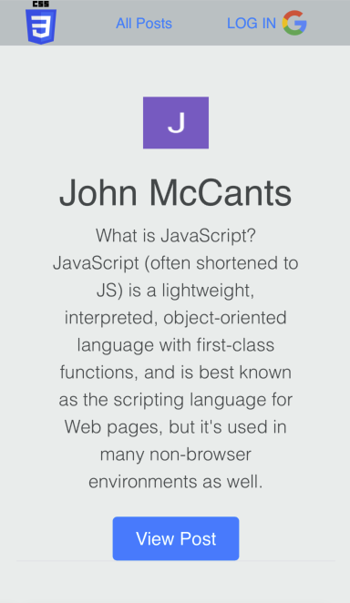

# Project 2 GA AKA John's Post App

In this app a user will be able to create a profile through signing in with Google. Then after that they will be able to Create, edit, and delete posts of their liking. 

## Screenshots

## Technologies Used

- Javascript
- CSS
- HTML
- Express
- MongoDB
- Google OAuth
- [Bootstrap](https://getbootstrap.com/)
- [Whimsical](https://whimsical.com/redditstyleproject2-LXnmncjYqE9vLD1cm3fBBV)
- [Trello](https://trello.com/b/UoFJWukE/project-2-ga)

## Getting started

# [DEPLOY LINK](https://project2generalassembly.herokuapp.com/)

## Future Iterations

- Add upvote feature
- Add comments
- Add view user profile

